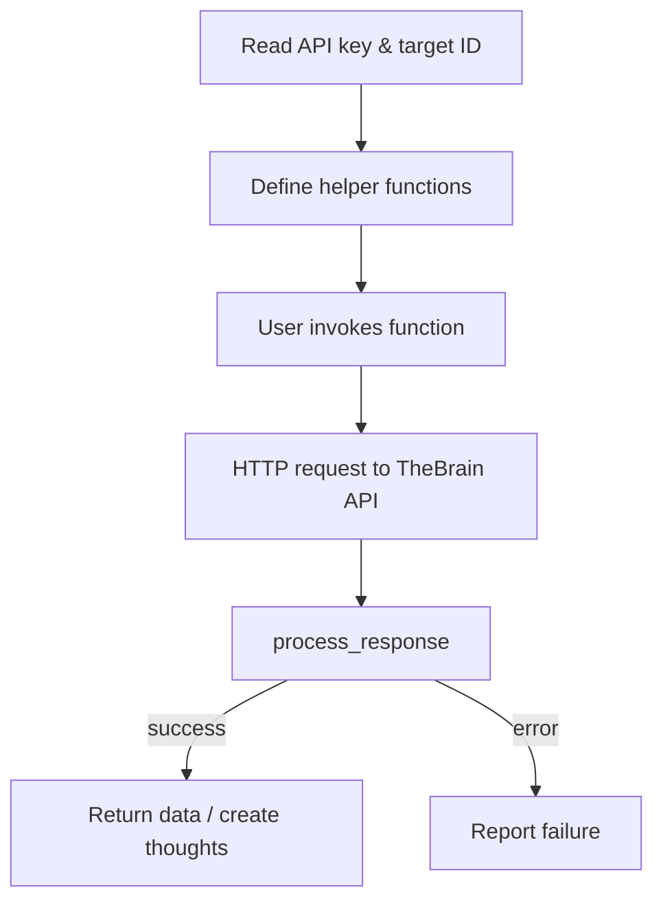

# Repository Overview
The repository provides Jupyter notebooks that demonstrate how to interact with [TheBrain](https://www.thebrain.com/) API. `BrainAPI.ipynb` offers a playground for issuing read-only and some write requests to manage thoughts, notes, links, and attachments, while `XKCD.ipynb` automates importing XKCD comics into a target brain.

# Directory and File Structure
```
/ (root)
├── BrainAPI.ipynb
├── XKCD.ipynb
├── readme.md
├── LICENSE
├── .gitignore
└── .gitattributes
```
- **BrainAPI.ipynb**: Notebook of reusable API helper functions and demo calls.
- **XKCD.ipynb**: Notebook for fetching XKCD comics and adding them to a brain.
- **readme.md**: Project overview and usage notes.
- **LICENSE**: MIT license.

# Core Components
## BrainAPI Notebook
- **Initialization cell** reads API key and target brain ID from `APIKey.txt` and `target.txt`.
- **Helper functions**:
  - `get(type, ...)` – central dispatcher for GET requests (listing brains, searching, retrieving notes, etc.).
  - `createThought`, `addNote`, `addURL`, `addAttachment`, `addLink` – POST helpers for creating and linking thoughts and attachments.
  - `process_response` – interprets HTTP responses and reports errors.
- **Demonstration cells** call the helpers to list brains, scan a brain, search thoughts, and retrieve named items.

## XKCD Notebook
- Reuses the same helper functions as `BrainAPI`.
- Adds a loop that downloads XKCD metadata and images, creates thoughts for each comic, attaches notes, URLs, tags, and images, and organizes them by year under a root `xkcd` thought.

# Data Flow or Control Flow


# External Dependencies
- **Python `requests`** – performs HTTP calls to TheBrain API and downloads XKCD images.
- **Python standard library** – `os`, `urllib.parse`, and `re` for filesystem access, URL encoding, and text parsing.

# Notable Design Decisions
- API credentials and target brain IDs are loaded from plain-text files (`APIKey.txt`, `target.txt`) rather than hard‑coded in notebooks.
- The `get` function uses a type switch to consolidate many endpoint calls behind a single interface.
- XKCD import organizes comics under year-specific parent thoughts and tags them for later retrieval.

# Limitations or Warnings
- Notebooks assume the presence of external files (`APIKey.txt`, `target.txt`); execution fails without them.
- Error handling is minimal; unexpected responses or network issues may disrupt execution.
- The XKCD importer may fail on certain comics due to external resource issues or missing transcripts.

# Error Handling
- `process_response` checks HTTP status codes (200, 500, 401, 404) and prints diagnostic messages.
- File operations and network requests are wrapped in `try/except` blocks to avoid crashes when credentials or downloads are missing.

